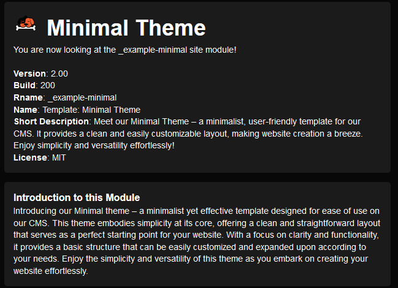
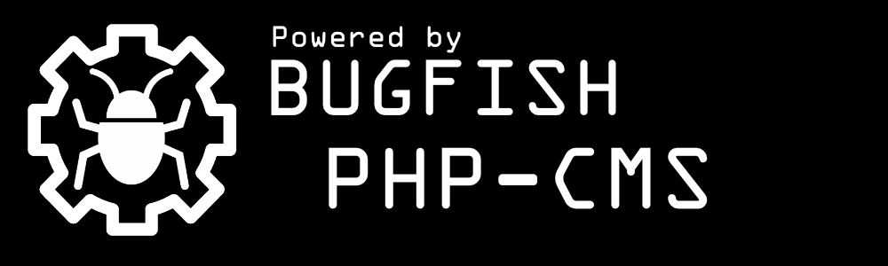

 

# bugfish-CMS
**Version Number Format**:  
CMSVersion-FrameworkVersion-AdminModuleVersion

**Interesting Links to documentation and more!**
- **Repository:** https://github.com/bugfishtm/bugfish-cms  
- **Documentation CMS:** https://bugfishtm.github.io/bugfish-cms/  
- **Documentation Framework**: https://bugfishtm.github.io/bugfish-framework/  
- **All Documentations**: https://bugfishtm.github.io  
- **Online Store URL**: https://store.bugfish.eu

## Introduction
Bugfish-CMS represents a cutting-edge Multi-Site CMS offering advanced backend capabilities for website module development. With an integrated store facilitating seamless downloading of various modules, this CMS stands out for its innovative technology and user-friendly approach. Its comprehensive README caters to both seasoned programmers and non-coders alike, emphasizing expedited multi-site deployment and development for complex projects.

Bugfish-CMS is not just for coders or developers; it offers a plethora of functionalities configurable via the administrator site module, catering to diverse needs. Unlike traditional CMS solutions, this framework isn't a ready-made system but a platform designed for individuals with coding expertise to develop custom modules. While it provides built-in functionalities in the administrator interface, its main focus is on extensibility, allowing users to create and integrate site modules to tailor the framework according to their specific requirements.

Below you can see a preview image of the _Administrator Site Module integrated in that cms!

## Repository Folders
Here you can find Information about this repositories Folder and File Structure!

| Folder      | Description                         |
| ----------- | ----------------------------------- |
| .github     | Files for sponsorship information and Issue and Fork Templates   |
| _docker-bugfish     | Files to deploy a "bugfishCMS" Docker Instance |
| _images   | Images related to the project |
| _licenses   | 3rd Party Licenses     | 
| _module     | Example CMS Modules which are more explained below in the "integrated modules" section |
| _releases   | Versioned Releases of this CRM Software |
| _source     | Source code for deployment          |
| docs        | Website documentation               |
| docs-ext        | 3rd Party Documentation         |
|.gitattributes | Internal File for this Repository |
|.gitignore | Internal File for this Repository |
|.gitkeep | Internal File for this Repository |
|CONTRIBUTING.md | Information about Project Contributing to Github |
| LICENSE.md | GPLv3 License for this project |
| README.md | The file you are actually reading! :) |

## Installation
Here you can find information on how to install the bugfishCMS Web Software!
For comprehensive explanations and detailed documentation about fast PHP page development, please visit www.bugfish-github.de/bugfish-cms. This website is the primary resource for in-depth information and guides on the topic.

### Method 1: Manual Installation
You can manually install this software on any webserver which is conform to requirements below!

#### Requirements
- Apache2 Webserver Recommended
- Apache2 Modules: Rewrite, Header, ssl (recommended)
- PHP 8.x (PHP 9 Not Tested)
- PHP Modules: zip, imagick, mysqli (may not listed modules will be asked for at installation)
- MariaDB Database Connection

#### Steps to Install
- Upload all files out of this repositories _source directory to your webspace public-html folder!
- Visit your URL in a Webbrowser, which points to the folder you just uploaded the files to.
- Go to ./installer.php and Install the CMS by providing required data.
- After the Installation you will be redirected to the CMS Login Page
- Login with data provided below in "Initial Login"
- You can now use the CMS and install new modules or extensions out of our official store! You can deploy your own modules to the _site folder, or use the installation manager at the administrator interface! You can develop own modules and remove the optional administrator module. You can even use standalone modules for single site instances. This CMS will be the only thing you need to accomplish every possible PHP Website goal!

### Method 2: Docker Installation
Look up the _docker-bugfish directory inside this repository to find more informations on how to deploy a docker container which is running an instance of "bugfishCMS".

### Initial Login
After you have initialized the CMS, a superuser with administrator privilegues will be created. This first created user is always an administrator and can always use all permissions without the need to obtain them. The initial user is the only user with that superuser privilegue, other users can be make to administrators by assigning permissions to them. If you are using user login functionality, the initial created user login data for the backend is as follows:  

**Username**: admin@admin.local (sometimes it is just "admin")  
**Password**: changeme

## Integrated Modules
If you are a developer trying to look into functionalities, you maybe should take a look at this CMS Example and Developer Modules. You can find them in this repositories "_module" folder. Feel free to read the readme.md file inside that folder to get more information about these modules and installation procedures!

## Integrated Functionalities
Here you can see a list and overview of the backend functionalities of this CMS. They are included to be used in different site modules, and you can even use data between site modules if required. See the example modules to explore on how to use the functionalities. They will help you achieve great goals and milestones on your project if you are able to master them.

| Functionality | Description |
|--------|-------|
|Multi-Site Management | Effortlessly manage multiple websites from a centralized platform, ensuring convenience and efficiency in overseeing various online properties.|
| User Management | Enables administrators to control user access and permissions within the CMS. This feature facilitates the creation, modification, and deletion of user accounts, as well as the assignment of roles and permissions. Effective user management ensures the security of the CMS and allows for tailored access levels, optimizing content collaboration and workflow efficiency. |
| Permission Management | This feature empowers administrators to finely control access to various functionalities and content within the CMS. Through permission management, administrators can assign specific permissions to individual users or groups, dictating their ability to view, edit, publish, or delete content. This granular control ensures data security, compliance with regulations, and facilitates efficient collaboration among users with distinct roles and responsibilities. |
| Groups Management | Groups management functionality allows administrators to organize users into distinct groups for streamlined access control and collaboration within the CMS. Administrators can create, modify, and delete groups, assigning specific permissions and access levels to each group as needed. This feature enhances efficiency by enabling bulk permission assignments and simplifies user management by categorizing users based on roles, departments, or projects.|
| Debug Functionalities | Empowering both website and module development, the platform provides robust debugging tools, aiding in backend operations for enhanced performance. |
| Framework Integration | This feature highlights seamless integration with the Bugfish Framework, providing robust bug tracking and debugging capabilities directly within the CMS interface. Users can efficiently report bugs, track their resolution status, and collaborate with developers, enhancing the overall quality and performance of the system.|
| Dynamic Themes | Allows for the dynamic switching of website themes, providing flexibility in design customization and user experience adaptation.|
| Dynamic Theme Colors | Enables dynamic adjustment of theme colors, empowering users to personalize the visual appearance of their website on-the-fly.|
| Dynamic CSS/JS Loadup | Facilitates the dynamic loading of CSS and JavaScript files, optimizing website performance and allowing for efficient resource management. |
| Dynamic Languages | Supports the dynamic addition and management of multiple languages, catering to diverse multilingual audiences and enhancing accessibility. |
| Installer | Streamlines the installation process of the CMS, ensuring easy setup and configuration for users, even with minimal technical expertise. |
| Updater | Automates the process of updating the CMS to the latest version, ensuring security patches, bug fixes, and new features are seamlessly integrated. |
| Extension Store | Provides a centralized marketplace for users to discover, install, and manage extensions, plugins, and add-ons, expanding the functionality of the CMS. |
| Own Dedicated Store | Offers users the option to set up their dedicated extension store, allowing for customization and monetization of extensions developed for the CMS. |
| Integrated Templates | Offers a selection of pre-designed templates integrated directly into the CMS, simplifying website design and customization processes. |
| Dynamic Code Loadup | Supports the dynamic loading of code snippets or scripts, enhancing flexibility and customization options for advanced users and developers. |
| Dynamic Cronjobs |  Enables the scheduling and execution of dynamic cronjobs within the CMS, automating routine tasks and optimizing system performance. |
| File Management | Provides robust file management capabilities within the CMS, allowing users to upload, organize, and manage files and media assets effectively. |
| CRM Functionalities | Integrates simple customer relationship management functionalities within the CMS.|
| Calender | Includes a built-in calendar feature for scheduling events, appointments, and reminders directly within the CMS interface, enhancing productivity and organization. |
| Task Management | Offers task management capabilities, allowing users to create, assign, and track tasks and workflows, streamlining project management processes. |
| Example Modules | Provides a collection of example modules showcasing various functionalities and capabilities of the CMS, serving as reference and inspiration for users and developers. |

## Integrated Themes
Some screenshots of integrated themes which can be used in development or are used in integrated modules! You can find explanations and functions for the different themes in the documentation at the "docs" folder inside this repository! All these themes are MIT-Licensed and can be used for different purposes!

### Simple Responsive Template
This template is integrated for easy use for developers inside the bugfishCMS. You can find function libraries to use this theme in the documentation (inside the docs folder)! This is the "Simple Responsive Email Template" from Github: https://github.com/leemunroe/responsive-html-email-template. This template is only html/css and does not feature bootstrap or other theming and frontend libraries! You can find example Modules in the repository on how to develop with that template style.

### Windmill Dashboard
This template is integrated with functions for easy use. See documentation for more informations. This template has been integrated out of the "Windmill Dashboard Theme" you can find on Github: https://github.com/estevanmaito/windmill-dashboard. It features TailwindCSS and has a ready to use theme which you can customize via custom css and more for your specific needs! You can find example Modules in the repository on how to develop with that template style.

### Volt Dashboard
The integrated Volt Theme features a full responsive and widely useable bootstrap 5 admin dashboard theme. You can find example Modules in the repository on how to develop with that template style. See the documentation for function use and explanation. The official github page of this theme is: https://github.com/themesberg/volt-bootstrap-5-dashboard  

### AdminBSB Dashboard
The most enhanced and functional theme is the AdminBSB Dashboard. It features a Bootstrap 3 environment with different libraries and pre-defined styles. This is the Material theme, it is used in the "Administrator" default Administration Module and the documentation is included in this repository. The official github page for this dashboard template is: https://github.com/gurayyarar/AdminBSBMaterialDesign   

## Support us
If you want to support us, add this banner to the project you have created!  

## How to get help?

Should you encounter any issues or have questions while using this software, please do not hesitate to reach out to us on our forum at [Bugfish Forum](www.bugfish.eu/forum). Additionally, you can request assistance via email at request@bugfish.eu, and we are dedicated to providing the support you require. We highly value your feedback and are committed to ensuring your success with our web project.

## 3rd Party Libraries

This project relies on third-party libraries stored in the '/_core/_vendor' folder. For more information about these libraries, their respective licenses, and to access their source code, please refer to our Documentation in the _docs folder, or the specific licenses in the _licenses folder inside this repository!

## Licensing Information

The bugfishCMS Project is released under the GPLv3 License, affording you the freedom to use, modify, and distribute the project as you see fit. It is imperative to note that the "/_core/_vendor" folder contains various libraries, each with its own unique licenses. To ensure full compliance and understanding of the licensing terms associated with these included libraries, we encourage you to consult our comprehensive documentation on our GitHub page. This documentation provides exhaustive information regarding the specific licenses and any additional requirements tied to individual libraries. Your responsible adherence to these licenses is pivotal when utilizing this project. Your interest and collaboration are greatly appreciated.
