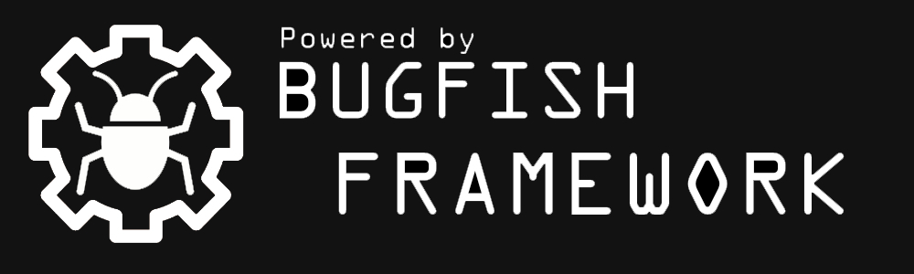

# Fast PHP Page

**Repository:** [Fast-PHP-Page Project](https://github.com/bugfishtm/fast-php-page)  
**Documentation:** [Comprehensive Documentation](https://bugfishtm.github.io/fast-php-page/)  
The detailed documentation, elucidating each function and class, can be found in this repository's "docs" folder. For a deeper understanding of the "Bugfish Framework," its complete integration, and functionalities, please visit [Bugfish-GitHub](https://www.bugfish-github.de). This project has been created with the "Bugfish Framework" and "Fast-PHP-Page" CMS. Besides that full documentation is available and present as a site module to be displayed in this CMS.

Documentation Bugfish Framework:  
https://www.bugfish-github.de/bugfish-framework  
Documentation Fast-PHP-Page:  
https://www.bugfish-github.de/fast-php-page    

**You can find Screenshots of templates and the software in this repositories _images folder or at the documentation available in the "docs" folder or at www.bugfish-github.de!**

## CMS Introduction
Introducing our cutting-edge Multi-Site CMS, a dynamic platform brimming with advanced backend capabilities for developing website modules. Featuring an integrated store for seamless downloading of diverse websites and modules, this CMS revolutionizes the landscape with innovative technology and strategies. Our focus on harnessing new ideas and technologies is evident in every aspect of this CMS, meticulously documented to cater to both seasoned programmers crafting site modules and users navigating its functionalities effortlessly, even without coding expertise. Explore the myriad features detailed below in our comprehensive README, designed to meet the diverse needs of developers and users alike. Our primary goal with this project is to expedite and enhance multi-site deployment and quick development für complex projects.

**This project is not only interesting for coders oder software developers! You have a very lot of functionalities which can be used and configured for your needs in the _administrator site module to maybe achieve some things you need to do!**

## Repository Folders

| Folder      | Description                         |
| ----------- | ----------------------------------- |
| .github     | Files for sponsorship information   |
| _source     | Source code for deployment          |
| docs        | Website documentation               |
| _releases   | Software releases                   |
| _images   | Some images for this readme file      |
| _licenses   | Some informations about used licenses     | 
| _modules   | Site Modules for Fast FP2 CMS, mostly for Documentations and development purposes! | 

## Quick Installation
- Upload all files out of this repositories _source directory to your webspace public-html folder!
- View the website which redirects to the folder you just uploaded the files to
- Go to ./installer.php and Install the CMS by providing required login data.
- View the url where you installed that CMS and you will be redirected to the _administrator Site module.
- Visit the store to install site modules, configure the administrator interface for your needs, install site module out of this repository by putting it in the _install folder of the website - or have fun developing!

## Site Modules delivered in _modules folder

**This modules are also available in the official bugfish.eu FP2 Store you can visit in the _administrator Site Module.** They are also available in this repositories _module folder for easy installing and deployment without using the bugfish store out of the administrator site module (or another one which is capable of store operations)
| Module      | Description                         |
| ----------- | ----------------------------------- |
|_documentation|Documentation Site Module containing the Documentation for the "Fast PHP Page" CMS|
|_documentation-adminbsb|Documentation Site Module containing the Documentation for the "AdminBSB" Template which is used in the _administrator Site Module.|
|_documentation-framework| Documentation Site Module containing the Documentation for the "Bugfish Framework"|
|_example-complex| Complex Site Module Solution with Windmill Theme Responsive Example to deploy on Page to view and understand for development purposes. |
|_example-minimal| Minimal Site Module Solution with Simple Theme Example to deploy on Page to view and understand for development purposes. |
|_simple-backend| A Simple backend which can be used together with frontpages (in multi site systems or with a standalone frontpage by setting this up in ruleset.php) or copied and changed for your own purposes! This is also a reference which is here to show you how to develope with the FP2 CMS.|

**In the _site directory of your installed CMS Instance you can find the installed Site Modules. The administrator Module is automatically installed and acts as main administrator backend. You can change this if required or use another administrator interface if one is available or setup.** This _administrator Site Module has a lot of different functionalities which can be used even without coding skills!

For comprehensive explanations and detailed documentation about fast PHP page development, please visit www.bugfish-github.de/fast-php-page. This website is the primary resource for in-depth information and guides on the topic.

## What is this project about?  
This repository hosts a framework that is not a complete, out-of-the-box CMS (Content Management System) that can be easily set up in the frontend. Instead, it is designed for individuals with coding expertise who wish to develop their own modules. While there are built-in functionalities available in the administrator interface for various purposes, the primary emphasis of this system lies in its extensibility. Users are encouraged to create and integrate site modules to tailor the framework to their specific requirements, making it a flexible and adaptable solution for those who have the technical skills to harness its potential.

## Key Features
Below you can see key features of this software! This are functionalities which are built in and available for development or to be used in downloaded site modules.

### Multi-Site Management
Effortlessly manage multiple websites from a centralized platform, ensuring convenience and efficiency in overseeing various online properties.

### Debugging Functionalities
Empowering both website and module development, the platform provides robust debugging tools, aiding in backend operations for enhanced performance.

### Rights and User Management
Granular control over user permissions and rights, facilitating secure access and management of resources within the CMS environment.

### Bugfish Framework Integration
Seamless integration of the Bugfish Framework into our CMS, enhancing its capabilities and extending its functionalities.

### Dynamic Theme and Theme Color Management
Customize themes and manage colors dynamically, enabling tailored visual experiences for websites created within the CMS.

### Streamlined Site Building with Templates
Utilize templates and pre-designed responsive CSS site styles, simplifying the creation of complex websites with ease.

### Diverse Functions and Templates
Access a wide array of functions and templates to expedite the development of sophisticated website backends and frontends.

### Multi-Language Support
Easily create multilingual websites, reaching diverse audiences through comprehensive language support.

### Database Change Updater
Effortlessly update deployed site modules and extensions, ensuring smooth transitions and maintenance.

### Installer Script
Deploy websites seamlessly with an installer script, simplifying the installation process for users.

### Integrated Store Functionality
Access an integrated store for module updates or leverage your own deployed store, expanding the capabilities of the CMS.

### Module Downloads within CMS
Conveniently download site modules directly within the CMS for various purposes, enhancing functionality and versatility.

### No Coding Knowledge Required
Users can leverage integrated software site modules without the need for coding knowledge, enabling quick implementation.

### Coding Flexibility
For users with coding expertise, the platform offers the freedom to create advanced functionalities rapidly.

## Initial Login
If you are using user login functionality, the initial created user for the backend is as follow:  
Username: admin@admin.local  
Password: changeme

## Extensive Project Documentation

Our project is meticulously documented, providing comprehensive guidance and information every step of the way. From installation instructions to in-depth explanations of features and functionalities, our documentation ensures a smooth and informed user experience. You'll find detailed resources, tutorials, and examples to assist you in harnessing the full potential of our platform, empowering you to create, manage, and optimize your projects effectively.

## Documentation Progress and Collaboration

We deeply appreciate your feedback and contributions as we strive to enhance our documentation and make the project more accessible to all. Your support and understanding are invaluable to us.

## Included Libraries

This project relies on third-party libraries stored in the '/_core/_vendor' folder. For more information about these libraries, their respective licenses, and to access their source code, please refer to our GitHub repository, where you can find detailed information and links to each library. (Eventually not all libraries are listed here)

| Folder Name                   | License  | Github Link                                                |
|-------------------------------|----------|-----------------------------------------------------------|
| alpine                        | MIT      | [Link](https://github.com/alpinejs/alpine)            |
| boxicons                        | MIT      | [Link](https://github.com/atisawd/boxicons)            |
| sortablejs                    | MIT      | [Link](https://github.com/SortableJS/Sortable)           |
| choices.js                    | MIT      | [Link](https://github.com/Choices-js/Choices)           |
| multi.js                      | MIT      | [Link](https://github.com/fabianlindfors/multi.js/)      |
| select2                       | MIT      | [Link](https://github.com/select2/select2)              |
| tinymce                       | MIT      | [Link](https://github.com/tinymce/tinymce)              |
| sweetalert2                   | MIT      | [Link](https://github.com/sweetalert2/sweetalert2)        |
| space_invader                 | MIT      | [Link](https://github.com/ozelentok/SpaceInvaders)      |
| resumable                     | MIT      | [Link](https://github.com/23/resumable.js)              |
| modelviewer                   | Apache   | [Link](https://github.com/google/model-viewer)         |
| leafletjs                     | BSD2     | [Link](https://github.com/Leaflet/Leaflet)              |
| jquery                        | MIT      | [Link](https://github.com/jquery/jquery)                |
| bugfish-jquery-sortselect | GPLv3  | [Link](https://github.com/bugfishtm/bugfish-jquery-sortselect) |
| datatables              | MIT     | [Link](https://github.com/DataTables/DataTables)       |
| magicsuggest            | MIT     | [Link](https://github.com/Magicsuggest/magicsuggest)   |
| free-file-icons                | MIT     | [Link](https://github.com/redbooth/free-file-icons)   |
| focustrap                      | MIT     | [Link](https://github.com/focus-trap/focus-trap)       |
| chartjs                        | MIT     | [Link](https://github.com/chartjs)                     |
| boxicons (<a href="https://boxicons.com" rel="noopener" target="_blank">Image List</a>) | MIT | [Link](https://github.com/atisawd/boxicons) |
| bugfish-dashboard              | GPLv3      | [Link](https://github.com/bugfishtm/bugfish-dashboard)    |
| country-flags-icons           | MIT      | [Link](https://github.com/ashhitch/ISO-country-flags-icons)    |
| animate-css           | HYP      | None   |
| autosize           | MIT      | None   |
| animate           | MIT      | None   |
| bootstrap           | MIT      | None   |
| bootstrap-colorpicker           | MIT      | None   |
| bootstrap-material-datetimepicker           | MIT      | None   |
| bootstrap-notify           | MIT      | None   |
| bootstrap-select           | MIT      | None   |
| bootstrap-tagsinput           | MIT      | None   |
| bugfish-dashboard           | GPLv3      | None   |
| chosen           | MIT      | None   |
| dropzone           | MIT      | None   |
| editable-table           | MIT      | None   |
| flot-charts           | MIT      | None   |
| gmaps           | MIT      | None   |
| ion-rangeslider           | MIT      | None   |
| jquery-cookie           | MIT      | None   |
| jquery-countto           | MIT      | None   |
| jquery-inputmask           | MIT      | None   |
| jquery-knob           | MIT      | None   |
| jquery-slimscroll           | MIT      | None   |
| jquery-sparkline           | MIT      | None   |
| jquery-spinner           | MIT      | None   |
| jquery-steps           | MIT      | None   |
| jquery-validation           | MIT      | None   |
| jvectormap           | AGPL      | None   |
| light-gallery           | GPLv3      | None   |
| material-design-iconic-font           | Apache      | None   |
| materialize-css           | MIT      | None   |
| momentjs           | MIT      | None   |
| morrisjs           | MIT      | None   |
| multi-select           | MIT      | None   |
| nestable           | MIT      | None   |
| node-waves           | MIT      | None   |
| nouislider           | MIT      | None   |
| raphael           | MIT      | None   |
| waitme           | MIT      | None   |
| Windmill Theme           | MIT      | None   |
| Responsive Mail Template          | MIT      | None   |
| Responsive Error Page          | MIT      | None   |

## Get Support

Should you encounter any issues or have questions while using this software, please do not hesitate to reach out to us on our forum at [Bugfish Forum](www.bugfish.eu/forum). Additionally, you can request assistance via email at request@bugfish.eu, and we are dedicated to providing the support you require. We highly value your feedback and are committed to ensuring your success with our web project.

If you want to support us, add this banner to the project you have created!  
 
## Licensing Information

The Fast-PHP-Page Project is released under the GPLv3 License, affording you the freedom to use, modify, and distribute the project as you see fit. It is imperative to note that the "/_core/_vendor" folder contains various libraries, each with its own unique licenses. To ensure full compliance and understanding of the licensing terms associated with these included libraries, we encourage you to consult our comprehensive documentation on our GitHub page. This documentation provides exhaustive information regarding the specific licenses and any additional requirements tied to individual libraries. Your responsible adherence to these licenses is pivotal when utilizing this project. Your interest and collaboration are greatly appreciated.
