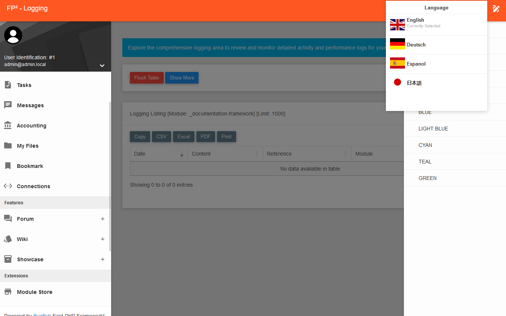
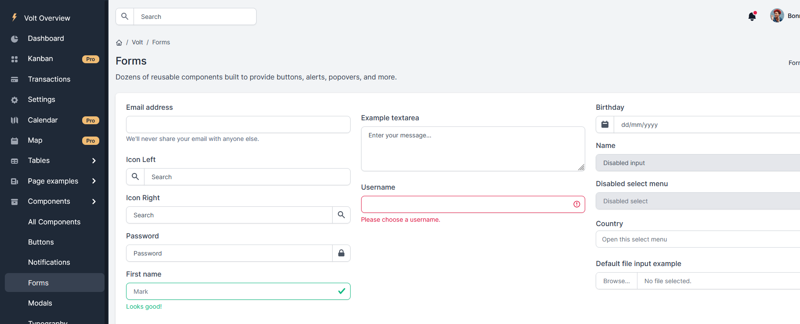
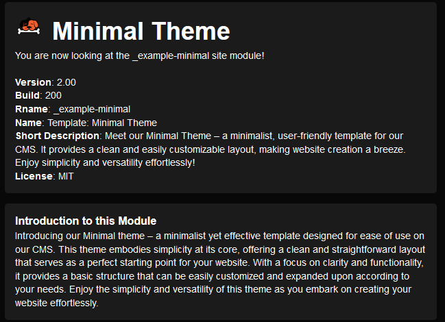

 

# Welcome to bugfishCMS!

Project Languages: 
 
 
 

| Title              | Link                                             |
|--------------------------|--------------------------------------------------|
| Repository               | [https://github.com/bugfishtm/bugfish-cms](https://github.com/bugfishtm/bugfish-cms)   |
| Documentation (CMS)      | [https://bugfishtm.github.io/bugfish-cms/](https://bugfishtm.github.io/bugfish-cms/)  |
| Documentation (Framework)| [https://bugfishtm.github.io/bugfish-framework/](https://bugfishtm.github.io/bugfish-framework/) |
| All Documentations       | [https://bugfishtm.github.io](https://bugfishtm.github.io)       |
| CMS Website / Store         | [https://store.bugfish.eu](https://store.bugfish.eu)           |
|CMS Tutorial Videos|https://www.youtube.com/playlist?list=PL6npOHuBGrpAfrpUzQPTOWdqoCnhq1oP0|

## Prologue

bugfishCMS is a powerful and versatile content management system designed to empower both end-users and developers alike. Whether you're a business owner looking to streamline your online presence or a developer seeking robust backend functionalities, bugfishCMS has you covered.

With bugfishCMS, you can effortlessly manage user permissions, debug your websites for optimal performance, and customize the administrator interface to suit your preferences. Enjoy multi-language support, dynamic color schemes, and a simplified installation process with our intuitive GUI installer.

For developers, bugfishCMS offers a comprehensive suite of backend features, including multi-site management, framework integration, debugging tools, and dynamic code loading capabilities. Seamlessly integrate with our Bugfish Framework and leverage ready-to-use updater routines for effortless project maintenance.

Explore our extension store for additional functionalities, manage files and media assets with ease, and harness integrated CRM tools for efficient customer relationship management. Plus, with features like calendar scheduling, task management, and project workflows, bugfishCMS helps boost productivity and organization.

Whether you're building a personal blog, an e-commerce platform, or a corporate website, bugfishCMS provides the flexibility, scalability, and developer-friendly interface you need to bring your vision to life. Get started with bugfishCMS today and unlock the full potential of your online presence!

### Repository Folders

Below is information about the folder and file structure of this repository:

| Folder      | Description                         |
| ----------- | ----------------------------------- |
| .github     | Contains files for sponsorship information and issue and fork templates   |
| _docker     | Includes files to deploy a "bugfishCMS" Docker instance |
| _images   | Contains images related to the project |
| _licenses   | Holds third-party licenses     | 
| _changelog   | Changelogs for release files.    | 
| _module     | Provides example CMS modules, further explained in the "Integrated Modules" section below |
| _releases   | Stores versioned releases of this CRM software |
| _source     | Contains the source code for deployment          |
| docs        | Contains documentation for the website               |
| docs-ext        | Contains third-party documentation         |
|.gitattributes | Internal file for this repository |
|.gitignore | Internal file for this repository |
|.gitkeep | Internal file for this repository |
|CONTRIBUTING.md | Provides information about contributing to the project on GitHub |
| LICENSE.md | Includes the GPLv3 license for this project |
| README.md | The file you are currently reading |

## Installation

### Requirements
- **Webserver:** Apache2 (recommended)
- **Apache2 Modules:** Rewrite, Header, SSL (recommended)
- **PHP:** 8.x (PHP 9 not tested)
- **PHP Modules:** zip, imagick, mysqli (additional modules may be required during installation)
- **Database:** MariaDB

### Steps

| Step | Action |
|------|--------|
| 1    | Upload all files from the `_source` directory to your webserver's `public-html` folder. |
| 2    | Open your web browser and navigate to your URL pointing to the uploaded folder. |
| 3    | Go to `./installer.php` and follow the prompts to install the CMS by providing the required data. |
| 4    | After installation, you will be redirected to the CMS login page. |
| 5    | Login using the initial credentials provided:   **Username:** `admin@admin.local` (sometimes just `admin`)   **Password:** `changeme` |
| 6    | Use the CMS to install new modules/extensions from the official store or deploy your own modules to the `_site` folder. |

### Initial Login

After initializing the CMS, a superuser with administrator privileges will be created. This initial user is always an administrator with full permissions and is the only user with superuser privileges. Other users can be made administrators by assigning permissions to them. The initial user login data for the backend is:

- **Username:** `admin@admin.local` (sometimes just `admin`)
- **Password:** `changeme`

## Features
Explore the comprehensive list of both backend and frontend functionalities within the CMS. These functionalities are designed to be seamlessly integrated into various site modules, with the flexibility to share data between them. Backend functionalities cater to developers, empowering them to create custom site modules, all managed and controlled through our integrated administrator module!

### End-User Functionalities
This section outlines the features available to end-users. No coding knowledge is required to use these functionalities, as they are included in our Administrator Module. Simply install the CMS and log in as the initial user as described in the installation guide to access all features listed below.

| Functionality | Description |
|---------------|-------------|
| **User and Group Manager** | Organize users into distinct groups for streamlined access control and collaboration. Link different features and functions to groups, giving you great control over your user base. Essential for managing user permissions and access levels, ensuring that only authorized users can access sensitive information. |
| **Debug Insights** | Maintain full control over multi-site debugging operations to ensure that your deployed websites and modules function perfectly. Crucial for developers and administrators to troubleshoot and optimize the performance of the CMS. |
| **Dynamic Colors** | Customize the appearance of the Administrator Module with various color schemes. Enhances user experience by allowing customization of the CMS interface to match branding or personal preference. |
| **Multi-Language Support** | Currently supports English, Japanese, German, and Spanish languages. Facilitates a broader reach by supporting multiple languages, enhancing usability for non-English speakers. |
| **Installer** | Simplified installation process with a graphical user interface (GUI). Reduces the technical barrier for end-users. |
| **Updater** | Easy-to-use updater with a graphical user interface (GUI) for seamless updates. Simplifies the maintenance of the CMS. |
| **Extension and Dedicated Store** | Centralized marketplace for discovering, installing, and managing extensions, including setting up a dedicated extension store for customization and monetization. Empowers users to enhance their CMS with additional functionalities tailored to their needs. |
| **File Management** | Robust file management capabilities for uploading, organizing, and managing files and media assets. Ensures efficient organization and retrieval of media and document files, crucial for content-heavy websites. |
| **CRM Functionalities** | Integrated customer relationship management functionalities within the CMS. Helps users manage customer relationships directly within the CMS. |
| **Calendar** | Built-in calendar feature for scheduling events, appointments, and reminders. Streamlines scheduling and improves productivity. |
| **Task Management** | Capabilities for creating, assigning, and tracking tasks and workflows. Improves overall productivity by managing tasks efficiently. |
| **Administration Interface** | Comprehensive, responsive administration backend featuring file management, user management, debugging insights, and access to the extension store. Centralizes all administrative functions, providing a user-friendly and powerful control panel. |
| **Store System and Module Downloads** | Fully functional store system for accessing and downloading site modules, enhancing website customization. |
| **Notes** | Allows users to create and manage personal notes. |
| **Notification System** | System notifications to inform users about events and changes. |
| **Administrator Dashboard** | Provides an overview and centralized control in an administrator dashboard. |
| **Project Management** | Tools for managing projects and project workflows. |
| **Customer Manager** | CRM manager for handling customers and related projects, tasks, and activities. |
| **Ticket System** | Ticketing system to track and resolve customer issues efficiently. |
| **Docker Control** | Integrated control of Docker containers within the CMS. Provides advanced users with tools to manage containerized applications, enhancing scalability and deployment flexibility. |
| **Forum Discussions** | Enables forum discussions among users. Promotes community engagement. |
| **Knowledge Base** | Create and share a knowledge base with users or the public. Enhances knowledge sharing and support. |
| **Inventory Manager** | Manage articles and inventory items efficiently. |
| **Newsletter Manager** | Tools for creating and managing newsletters. |
| **Comments** | Manage comments across different site areas. |
| **MySQL Manager** | Integrated SQL tools for managing connected databases. |

### Developer-Related Functionalities

These backend functionalities are tailored for developers and are essential for site modules requiring advanced coding knowledge. If there is no site module to generate the necessary code, developers can directly utilize these functionalities. Below is a detailed overview of the available backend features:

| Functionality | Description |
|---------------|-------------|
| **Multi-Site Management** | Effortlessly manage multiple websites from a centralized platform, ensuring efficient oversight of various online properties. |
| **Framework Integration** | Seamlessly integrate with the Bugfish Framework for comprehensive bug tracking and debugging capabilities, including all classes and functionalities of CSS, JavaScript, and PHP Libraries. |
| **Debugging Tools** | Access robust debugging tools to enhance backend operations, quickly identify errors, and test site performance or SQL issues with various classes. |
| **Multi-Language Support** | Dynamically add and manage multiple languages to cater to a global audience. |
| **Dynamic Themes and Colors** | Enable dynamic switching of website themes and adjustment of theme colors for a personalized appearance. |
| **Dynamic CSS/JS Load** | Facilitate the dynamic loading of CSS and JavaScript files for optimized website performance. |
| **Installer Backend** | Utilize ready-to-use installer routines per Site Module for seamless project setup. |
| **Updater Backend** | Leverage ready-to-use updater routines per Site Module for effortless project updates. |
| **Dynamic Code Loading** | Support the dynamic loading of code snippets or scripts for advanced customization options. |
| **Dynamic Cronjobs** | Schedule and execute dynamic cronjobs within the CMS to automate routine tasks. |
| **Advanced User Operations** | Access pre-written user operations such as email activation and password recovery for enhanced user management. |
| **Extension Support** | Extend different modules with custom or store-downloaded extensions. |
| **CMS Folder Structure** | Utilize an easy-to-use folder structure that accommodates all necessary data, allowing for straightforward backups and restoration. |
| **Deployment** | Deploy your own cluster of bugfishCMS instances and control module and core update deployments via your own instances public store. |
| **Integrated Templates** | Access a selection of pre-designed templates integrated into the CMS for simplified website design and customization. |
| **Example Modules** | Explore a collection of example modules showcasing various functionalities and capabilities of the CMS, serving as references and inspiration for users and developers. |
| **Developer-Friendly Interface** | Utilize a comprehensive user interface tailored for developers to access and manipulate the system through coding, enabling extensive customization and advanced functionality. |
| **Page and Procedure Building** | Design web pages and create complex workflows using pre-designed, extendable widgets for visually appealing and user-friendly pages. |
| **Database Change Updater** | Dynamically update the database to align with the current build version, ensuring smooth transitions and robust database management. |
| **Control Scripts** | Employ various scripts to control the software during development, simplifying the developer's workflow. |

These functionalities offer extensive tools and resources for developers to create, manage, and optimize websites efficiently, ensuring a high level of customization and performance.

## Modules
If you are a developer looking into functionalities, you might want to check out this CMS example and the developer modules. You can find them in the "_module" folder of these repositories. Be sure to read the README.md file inside that folder to get more information about these modules and installation procedures!

### Website Modules
Website modules can be run as standalone websites or alongside other installed website modules. They can be distributed across various domains and virtual hosts, using integrated functionalities to display many websites with just one instance. This allows for full control over our administration or another administration module, according to your needs!

| Name | Description |
| --------- | ----------------------------------- |
| _documentation-adminbsb     | Documentation for the integrated AdminBSB Template.   |
| _documentation-volt     | Documentation for the integrated Volt Template.   | 
| _documentation-framework     | Documentation for the integrated Bugish Framework.   |
| _documentation   | Documentation for this CMS integrated as a site module.      |
| _lab   | Module used at lab.bugfish.eu to showcase different site modules with a token! A very simple minimal site module, just to redirect to the internal CMS Token Switch to Module Page. | 
| _example-minimal        | Minimal site module example. A minimal responsive open-source template.  | 
| _example-windmill   | Windmill Dashboard site module example. A TailwindCSS open-source template.   | 
| _example-volt   | Volt Dashboard site module example. A Bootstrap 5 open-source template.     | 
| _skeleton   | Skeleton of site modules for developers to explore and understand folder functionalities and more! Very minimalistic. If you are looking for an enhanced site module to gain development insights, take a look at the integrated _administrator site module!    | 
| _storepage   | Module used at store.bugfish.eu to showcase the internal store, deployable on other instances as a dedicated website! Works together with the Administration Module to showcase different available modules for deployment. Features the Volt Dashboard Theme. |
| _administrator   | Most enhanced and documented example/useable module. This module is the main administration module integrated into the core version of the CMS. You can delete the module if you do not need it. You can find it in the _site/_administrator folder of your CMS instance.   | 

### Extension Modules
Extension modules can extend the functionality of single site modules. An extension module always fits a specific site module to be executed and used there. It may change navigation/permission entries and much more, depending on the module. Extension modules extend the functionality of existing site modules without editing the site module's code itself.

| Name | Description |
| --------- | ----------------------------------- |
| _exts6example   | Extension module example, deployable on a _administrator module installation inside your CMS. Check the _module folder inside this repository for the module's zip file and installation guide.|

### Script Modules
Script modules can be included in site modules that support them. An installed script module is ready to use for all CMS installed site modules and is not related to a specific site module.

| Name | Description |
| --------- | ----------------------------------- |
| _screxample   | Extension script example that can be used on all site modules supporting its display. You can test this example script in our administrator module if you want to! |

### Image Modules
Full deployable Website Modules to easily deploy other projects and include controlling functionalities inside the cms. Primary Focus is to deploy 3rd party software like docker and other to vhosts. Will serve for vhosts for integrated hosting functionalities at implementation.

| Name | Description |
| --------- | ----------------------------------- |
| _imgexample   | Exmaple Image Website Module for developers to look up its functionality! |

## Theme Libraries

Below are screenshots and descriptions of integrated themes that can be used in development or are utilized in integrated modules. Detailed explanations and functions for each theme can be found in the documentation located in the "docs" folder within this repository. All these themes are MIT-Licensed and can be used for various purposes.

### Simple Responsive Template

This template is seamlessly integrated for easy developer use within the bugfishCMS. It is a "Simple Responsive Email Template" sourced from GitHub ([link](https://github.com/leemunroe/responsive-html-email-template)), comprising only HTML/CSS without any additional frontend libraries like Bootstrap. Example modules in the repository demonstrate how to develop using this template style.

### Windmill Dashboard

This template comes integrated with functions for straightforward use. Refer to the documentation for more details. Derived from the "Windmill Dashboard Theme" on GitHub ([link](https://github.com/estevanmaito/windmill-dashboard)), it utilizes TailwindCSS and offers a ready-to-use theme that can be further customized via custom CSS to suit specific requirements. Example modules in the repository illustrate development using this template style.

### Volt Dashboard

The integrated Volt Theme provides a fully responsive and widely usable Bootstrap 5 admin dashboard theme. Example modules in the repository demonstrate how to develop using this template style. Refer to the documentation for function usage and explanations. Visit the official GitHub page for this theme: [Volt Bootstrap 5 Dashboard](https://github.com/themesberg/volt-bootstrap-5-dashboard).

### AdminBSB Dashboard

The AdminBSB Dashboard is the most enhanced and functional theme, featuring a Bootstrap 3 environment with various libraries and pre-defined styles. The Material theme showcased here is used in the "Administrator" default Administration Module, with documentation included in this repository. For further details, visit the official GitHub page: [AdminBSBMaterialDesign](https://github.com/gurayyarar/AdminBSBMaterialDesign).

## You need support or you found a bug?

Should you encounter any issues or have questions while using this software, please do not hesitate to reach out to us on our forum at [Bugfish Forum](www.bugfish.eu/forum). Additionally, you can request assistance via email at request@bugfish.eu, and we are dedicated to providing the support you require. We highly value your feedback and are committed to ensuring your success with our web project.

## Licensing Information

This project incorporates third-party libraries located in the '/_core/_vendor' folder. For detailed information about these libraries, their licenses, and to access their source code, please refer to our documentation in the '_docs' folder or review the specific licenses in the '_licenses' folder within this repository. The BugfishCMS Project is released under the GPLv3 License, which grants you the freedom to use, modify, and distribute the project. 

Please note that the '/_core/_vendor' folder contains various libraries, each governed by its own unique license. To ensure full compliance and understanding of these licensing terms, we strongly encourage you to consult our comprehensive documentation available on our GitHub page. This documentation provides detailed information regarding the specific licenses and any additional requirements associated with each library. 

Adherence to these licenses is essential when using this project. We greatly appreciate your interest and collaboration.
