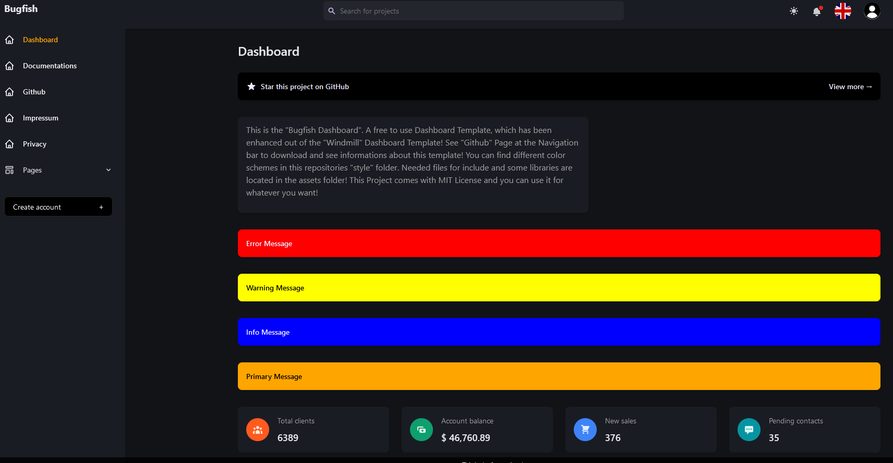

# Bugfish Dashboard
Visit for demo: https://bugfishtm.github.io/bugfish-dashboard/page_index.html  
Repository: https://github.com/bugfishtm/bugfish-dashboard  

This is the "Bugfish Dashboard". A free to use Dashboard Template, which has been enhanced out of the "Windmill" Dashboard Template! You can find different color schemes in this repositories "style" folder. Needed files for include and some libraries are located in the assets folder! This Project comes with MIT License and you can use it for whatever you want!
				
A simple Dashboard Template which is a modification of "Windmill" Dashboard Template. Added new Style functionalities and a few new Elements. This project has initially created out of this project:  
https://github.com/estevanmaito/windmill-dashboard

## Color Schemes
This dashboard comes in color schemes "purple", "orange" and "lime".  
You can find related CSS Files in the styles folder!

Screenshot:

## Included Libraries
Included in this repository are some MIT Libraries which you may can use with your software if needed.  

|Name|License|Description|
|--|--|--|
|alpine|MIT|Needed Library for Dashboard|
|css / tailwindcss|MIT|Needed CSS Library for Dashboard|
|chartjs | MIT|Library to Display Charts|
|datatables|MIT|Library to Display Datatables|
|focustrap|MIT|Library for Dashboard Elements|
|jquery|MIT| jquery 3.5 Library|
|resumable|MIT|Chunk Upload JS Library|
|TinyMCE|MIT|Advanced Textarea Boxes Library|

## Support and Requests

In the event that you encounter any challenges or have inquiries while using this software, we encourage you to reach out for assistance. Our dedicated support platform is available through our forum located at https://forum.bugfish.eu. This specialized forum serves as a central hub for addressing any issues, seeking solutions, and engaging in discussions related to the software's functionality.

Rest assured that our team is committed to promptly addressing your concerns and providing the guidance necessary to ensure a seamless software experience. Your feedback is invaluable in our ongoing efforts to refine and enhance the software, and we welcome your contributions to our community.

You can also write us at request@bugfish.eu if you encounter any errors using this software. We will try the best to help you!

## Included Libraries with MIT Licenses

This project includes several third-party libraries, each distributed under the MIT License. You can find the contents of these libraries in the "assets" folder, along with their respective license files. This ensures compliance with licensing requirements and provides transparency regarding the usage of third-party code in the project.

## License Information

The license details for this Bugfish Dashboard project can be found in the "license.md" file within the project repository. Please review this file to understand the terms and conditions of use and distribution. It is essential to comply with the project's license to ensure legal and ethical usage of the provided resources. This project is a fork of the Windmill Dashboard theme. You can find the Root License at ROOT_LICENSE.md inside that repository. We have choosen the license to prevent damaging patenting of this software. You are allowed to use this software commercial and private, enhanced version of the software even closed source! You are not allowed to patent any part of this given repository.